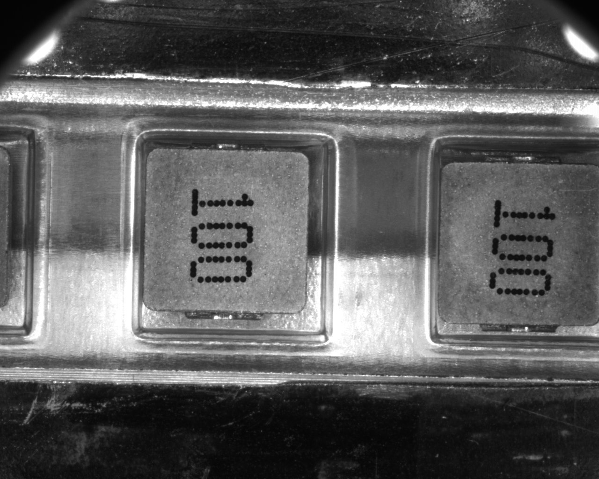
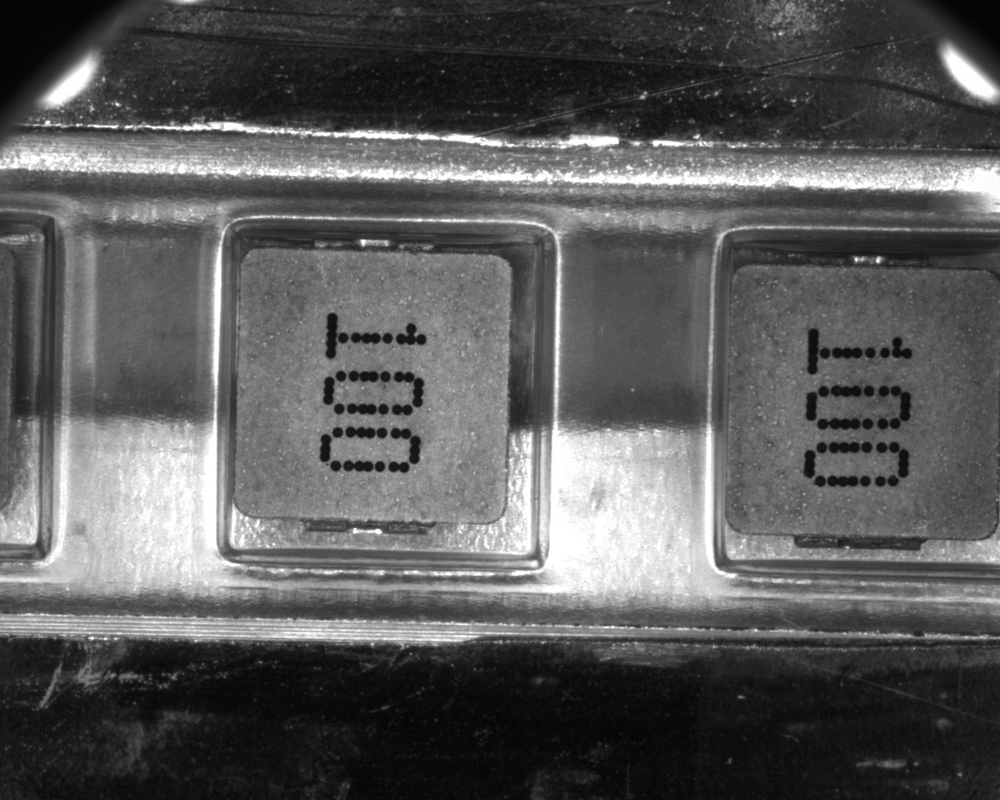
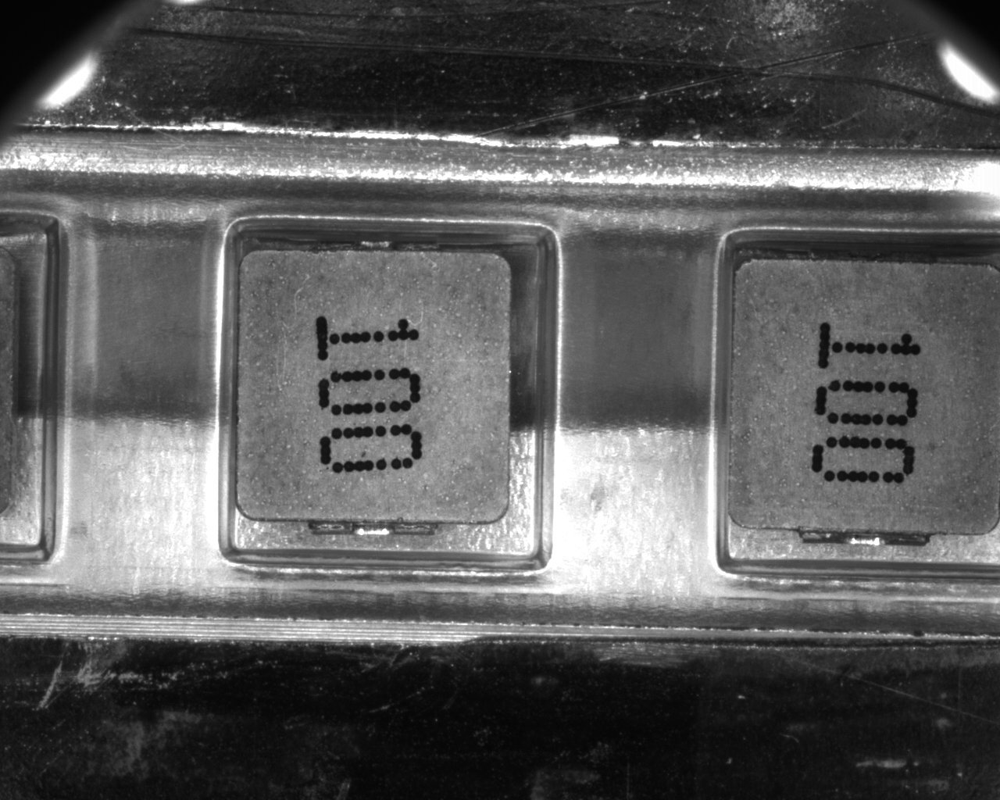

# Template Matching

## 目錄
- [讀取檔案](#讀取檔案)
- [調整模板影像](#調整影像)
- [縮小影像](#縮小影像)
- [計算相似度](#計算相似度)
- [定義閾值](#定義閾值)
- [結果視覺化](#結果視覺化)
---
## 讀取檔案
利用cv2.imread()讀取影像，此時會讀取三種類型影像。
- 彩色目標影像
- 灰階目標影像
- 灰階模板影像

## 調整模板影像
因不同的目標影像可能與初始模板影像相似度較低的原因，有可能的原因是存在著角度偏移或影像大小不同所導致，因此`rot_image(image, rotation, scale)`是使影像進行旋轉及縮放。
- 各影像的旋轉及放大處理
    | Data  | scale | angle |
    | :---: | :---: | :---: |
    | 100-1 |   X   |   X   |  
    | 100-2 |   X   |   $1{\degree}$   |  
    | 100-3 |   X   |   X   |  
    | 100-4 |   X   |   X   |  
    | Die-1 |   X   |   $2{\degree}$   |  
    | Die-2 |   X   |   $-2{\degree}$   |  


```python
def rot_image(img, rot=0, scale=1):
    s = 1 + (1-scale)
    rot_img = np.zeros((img.shape[0], img.shape[1])).astype(np.uint8)
    for i in range(img.shape[0]):
        for j in range(img.shape[1]):
            adjust_i = i - (img.shape[0]//2)
            adjust_j = j - (img.shape[1]//2)
            x = int(s*(adjust_j*np.cos(np.radians(rot)) - adjust_i*np.sin(np.radians(rot))))
            y = int(s*(adjust_j*np.sin(np.radians(rot)) + adjust_i*np.cos(np.radians(rot))))
            re_x = x + (img.shape[1]//2)
            re_y = y + (img.shape[0]//2)
            if 0 <= re_x < img.shape[1]:
                if 0 <= re_y < img.shape[0]:
                    rot_img[i, j] = img[re_y, re_x]
                else:
                    rot_img[i, j] = 0
            else:
                rot_img[i, j] = 0

    return rot_img
```

## 縮小影像
由於原始模板影像進行multi-sum所耗費時間過長且如此較沒效率，因此透過Pyramid Down將目標影像及模板影像同時縮小，可以大幅縮短萃取特徵所花費的時間。
|Data |縮小倍率|
|:---:|:---:|
| 100 |  16 |
| Die |  8 |

## 計算相似度
此次專案利用Texture Matching中Normalized Correlation Coeffiecient(NCC)來計算特徵相似度。
```python
def get_matching_result(img, tmp, output_img):
    tmp_u = np.mean(tmp)
    for i in tqdm(range(output_img.shape[0])):
        for j in range(output_img.shape[1]):
            #tmplate
            inner = 0
            norm_tmp = 0
            norm_img = 0
            # 計算符合template大小的原始影像平均值
            img_sum = [img[i+ti,j+tj] for ti in range(tmp.shape[0]) for tj in range(tmp.shape[1])]
            img_u = np.mean(img_sum)
            for ti in range(tmp.shape[0]):
                for tj in range(tmp.shape[1]):
                    t = tmp[ti, tj] - tmp_u
                    im = img[i+ti,j+tj] - img_u
                    inner += t*im 
                    norm_tmp += np.power(t, 2)
                    norm_img += np.power(im, 2)
            output_img[i, j]= (inner)/np.sqrt(norm_img*norm_tmp)
    return output_img
```

## 定義閾值
若閾值定義過低，會取得不是我們所期望的結果；閾值定義過高，則會使有些結果無法辨識出來。因此定義適當閾值是在此專案中重要的問題之一。
- 各影像的閾值
    |  Data | threshold |
    | :---: |   :---:   |
    | 100-1 |    0.5    |
    | 100-2 |    0.4    |
    | 100-3 |    0.5    |
    | 100-4 |    0.5    |
    | Die-1 |    0.79   |
    | Die-2 |    0.747  |

## 結果視覺化
最後利用opencv.rectangle()等視覺化工具將結果進行輸出，得到成功辨識後的影像結果。
- 100
<p float="left">
      
      
</p>
- Die
<p float="left">
      
</p>