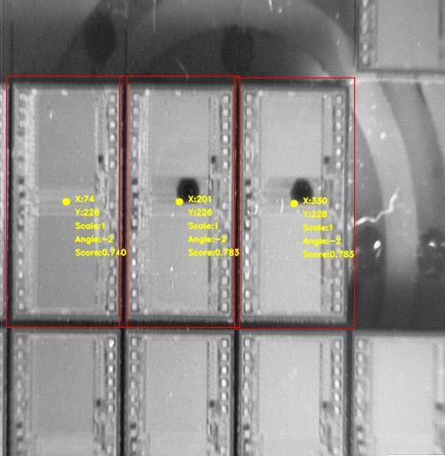

## Content
- [Project Description](#project-description)
- [Read File](#read-file)
- [Adjust template image](#adjust-template-image)
- [zoom-out](#zoom-out)
- [small-scale calculations](#small-scale-calculations)
- [Calculate similarity](#Calculate-similarity)
- [Define Threshold](#Define-Threshold)
- [Visualize](#Visualize)
---
## Project Description
The purpose of this project is to find the template location from the original image, is called Tempalte Matching. In order to speed up the code, the Pyramid Down method will be used.

## Read File
There are three types of images read through `cv2.imread()`.
- the target image of color
- the target image of gray
- the template image of gray

## Adjust template image
Different target images may not be very similar to the initial template image, possibly due to angular offsets or different image sizes. So `rot_image(image, rotation, scale)` is to rotate and scale the image.
- Rotation and magnification of each image
    | Data  | scale | angle |
    | :---: | :---: | :---: |
    | 100-1 |   X   |   X   |  
    | 100-2 |   X   |   1°  |  
    | 100-3 |   X   |   X   |  
    | 100-4 |   X   |   X   |  
    | Die-1 |   X   |   2°  |  
    | Die-2 |   X   |   -2° |  


```python
rot_image(img, rot=0, scale=1):
```

## zoom-out
Since the multiple summation of the original template image takes too long and is inefficient, reducing the target image and the template image at the same time through Pyramid Down can greatly shorten the time spent in extracting features.
|Data |reduction ratio|
|:---:|:---:|
| 100 |  16 |
| Die |  8 |

## small-scale calculations
When we find a high similarity value in the reduced dimensionality image, we need to restore the size of the original image to calculate the similarity in a small range. Since there is an error in the restored image itself, the search range is designed to be set according to the reduction ratio.
```python
get_small_matching_result(img, tmp, points, resize_ratio=8)
```

## Calculate similarity
This project uses **Normalized Correlation Coeffiecient(NCC)** in Texture Matching to calculate feature similarity.
```python
get_matching_result(img, tmp, output_img):
```

## Define Threshold
Defining appropriate thresholds is one of the important issues for this project.
- The threshold of each image
    |  Data | threshold |
    | :---: |   :---:   |
    | 100-1 |    0.5    |
    | 100-2 |    0.4    |
    | 100-3 |    0.5    |
    | 100-4 |    0.5    |
    | Die-1 |    0.79   |
    | Die-2 |    0.747  |

## Visualize
Finally, use `opencv.rectangle()` and other visualization tools to output the result, and get the image result after the recognition is successful.
- 100
    - cost time(s)
        |  Data | My method | OpenCV |
        | :---: |   :---:   | :---:  |
        | 100-1 |   593.04  | 0.42   |
        | 100-2 |   595.29 | 0.41   |
        | 100-3 |   588.19 | 0.40   |
        | 100-4 |   591.19 | 0.40   |
        

<p float="left">
      
      
      
      
</p>


- Die
    - cost time(s)
        |  Data | My method | OpenCV |
        | :---: |   :---:   | :---:  |
        | Die-1 |   204.11  |   0.39 |
        | Die-2 |   205.34  | 0.34   |

        
<p float="left">
      
      
</p>
