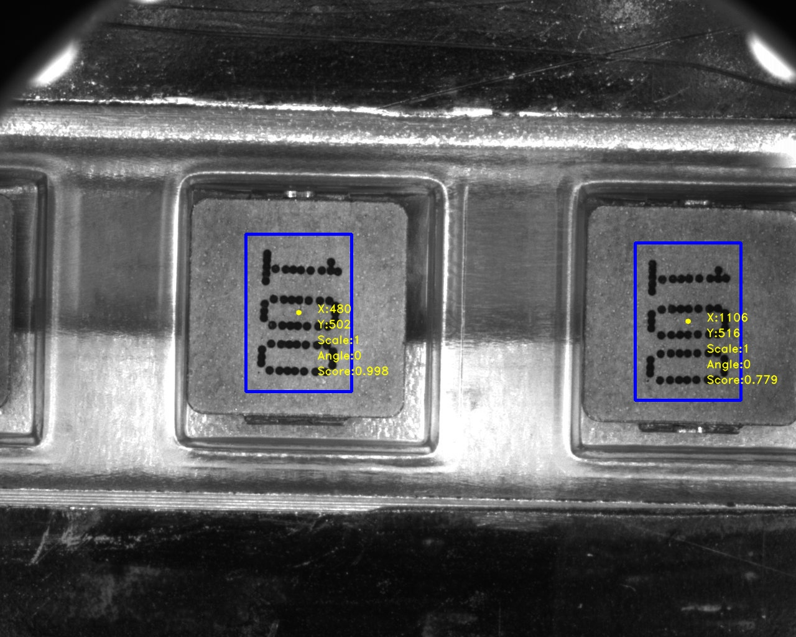
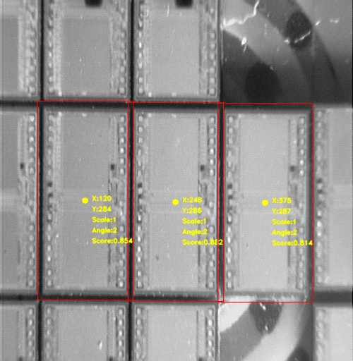

# Template Matching

## 目錄
- [讀取檔案](#讀取檔案)
- [調整模板影像](#調整模板影像)
- [縮小影像](#縮小影像)
- [小範圍計算](#小範圍計算)
- [計算相似度](#計算相似度)
- [定義閾值](#定義閾值)
- [結果視覺化](#結果視覺化)
---
## 讀取檔案
利用cv2.imread()讀取影像，此時會讀取三種類型影像。
- 彩色目標影像
- 灰階目標影像
- 灰階模板影像

## 調整模板影像
因不同的目標影像可能與初始模板影像相似度較低的原因，有可能的原因是存在著角度偏移或影像大小不同所導致，因此`rot_image(image, rotation, scale)`是使影像進行旋轉及縮放。
- 各影像的旋轉及放大處理
    | Data  | scale | angle |
    | :---: | :---: | :---: |
    | 100-1 |   X   |   X   |  
    | 100-2 |   X   |   1°  |  
    | 100-3 |   X   |   X   |  
    | 100-4 |   X   |   X   |  
    | Die-1 |   X   |   2°  |  
    | Die-2 |   X   |   -2° |  


```python
rot_image(img, rot=0, scale=1):
```

## 縮小影像
由於原始模板影像進行multi-sum所耗費時間過長且如此較沒效率，因此透過Pyramid Down將目標影像及模板影像同時縮小，可以大幅縮短萃取特徵所花費的時間。
|Data |縮小倍率|
|:---:|:---:|
| 100 |  16 |
| Die |  8 |

## 小範圍計算
當我們在降維的影像中找到相似度較高的數值時，需還原為原本影像的大小進行小範圍計算相似度。因還原影像本身存在著誤差，故搜索範圍此設計為按照所縮小倍數進行設定。
```python
get_small_matching_result(img, tmp, points, resize_ratio=8)
```

## 計算相似度
此次專案利用Texture Matching中 **Normalized Correlation Coeffiecient(NCC)** 來計算特徵相似度。
```python
get_matching_result(img, tmp, output_img):
```

## 定義閾值
若閾值定義過低，會取得不是我們所期望的結果；閾值定義過高，則會使有些結果無法辨識出來。因此定義適當閾值是在此專案中重要的問題之一。
- 各影像的閾值
    |  Data | threshold |
    | :---: |   :---:   |
    | 100-1 |    0.5    |
    | 100-2 |    0.4    |
    | 100-3 |    0.5    |
    | 100-4 |    0.5    |
    | Die-1 |    0.79   |
    | Die-2 |    0.747  |

## 結果視覺化
最後利用opencv.rectangle()等視覺化工具將結果進行輸出，得到成功辨識後的影像結果。
- 100
    - cost time(s)
        |  Data | My method | OpenCV |
        | :---: |   :---:   | :---:  |
        | 100-1 |   593.04  | 0.42   |
        | 100-2 |   595.29 | 0.41   |
        | 100-3 |   588.19 | 0.40   |
        | 100-4 |   591.19 | 0.40   |
        

<p float="left">
      
      
      
      
</p>


- Die
    - cost time(s)
        |  Data | My method | OpenCV |
        | :---: |   :---:   | :---:  |
        | Die-1 |   204.11  |   0.39 |
        | Die-2 |   205.34  | 0.34   |

        
<p float="left">
      
      
</p>
